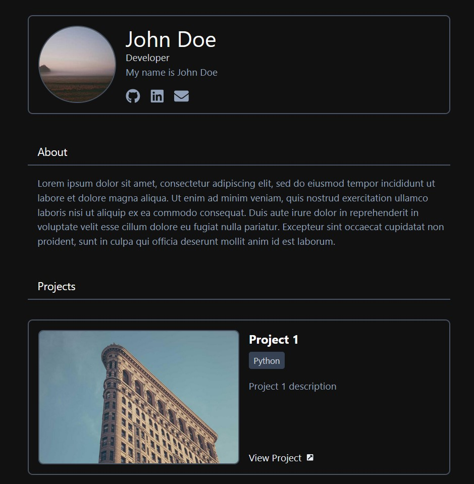

# React Portfolio Template

This project is a responsive portfolio website built using Vite, React, and Tailwind CSS. It provides a simple template that can be filled with your own information and customized according to your needs.



## See it Live

You can see a live demo of the portfolio template [here](https://www.blaicalero.com).

## Features

- **Responsive**: Responsive layout for any device.
- **Customizable**: Change any stylings and information to suit your needs.
- **React Icons**: Uses React Icons.
- **Tailwind CSS**: Uses Tailwind CSS v4.

## Getting Started

To get started with this template, follow the instructions below.

### Prerequisites

Make sure you have the following installed:

- [Node.js](https://nodejs.org/) (version 14 or higher)
- [npm](https://www.npmjs.com/) (comes with Node.js)

Alternatively use your own preferred package manager.

### Installation

1. Clone the repository:

   ```bash
   git clone https://github.com/Blai-C/simple-portfolio-template.git
   ```

2. Navigate to the project directory:

   ```bash
   cd portfolio-template
   ```

3. Install the dependencies:

   ```bash
   npm install
   ```

### Running the Development Server

To start the development server, run:

```bash
npm run dev
```

Open your browser and go to `http://localhost:5173` to see your portfolio in action.

### Customizing Your Portfolio

1. Change the placeholder names and descriptions to suit your needs.
2. Open the `src/data/projects.json` file.
3. Replace the sample data with your own projects. The structure of the JSON file is as follows:

   ```json
   [
    {
        "title": "value",
        "description": "value",
        "technologies": [
            "value"
        ],
        "link": "value",
        "image": "value"
    },
    {
        "title": "value",
        "description": "value",
        "technologies": [
            "value"
        ],
        "link": "value",
        "image": "value"
    }
   ]
   ```

## Build

1. Build the project:

   ```bash
   npm run build
   ```

## Contributing

If you have suggestions for improvements or features, feel free to open an issue or submit a pull request. Alternatively, feel free to fork this repository and modify it as you see fit.

## License

This project is licensed under the MIT License. See the [LICENSE](LICENSE) file for details.

## Acknowledgments

- [Vite](https://vitejs.dev/)
- [React](https://reactjs.org/)
- [Tailwind CSS](https://tailwindcss.com/)
- [React Icons](https://react-icons.github.io/react-icons/)

---
